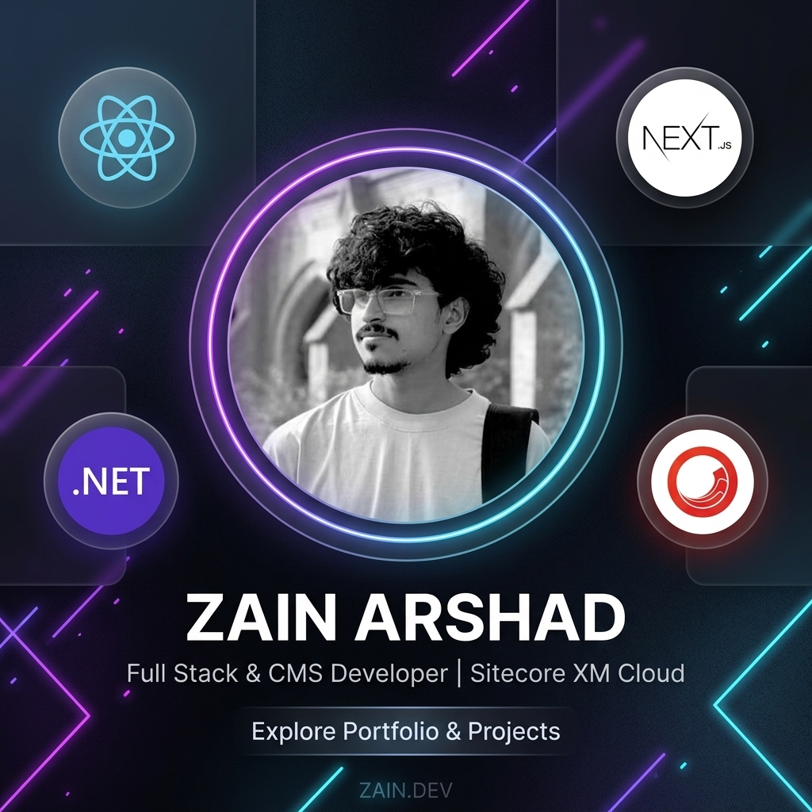

# 🚀 Zain Arshad | Full-Stack & Sitecore XM Cloud Developer Portfolio

<div align="center">

[](https://nextjs.org/)
[](https://react.dev/)
[](https://tailwindcss.com/)
[](https://www.typescriptlang.org/)
[](https://www.sitecore.com/)

<p align="center">
  A premium, high-performance developer portfolio built with a state-of-the-art tech stack. Featuring glassmorphic user interfaces, fluid animations, responsive layouts, and highly optimized search engine metadata.
</p>

[✨ Live Preview](#) · [🛠️ Technologies](#-tech-stack) · [🚀 Setup](#%EF%B8%8F-getting-started)

---

</div>

## 🌟 Key Features

*   **Premium Visual Design**: Dark mode aesthetic with curated glassmorphism, neon glow accents, and custom typography.
*   **Fully Responsive & Interactive**: Built with Tailwind CSS and powered by `framer-motion` for fluid scroll-reveal transitions.
*   **Next.js App Router**: Optimized folder structure with client/server components separation.
*   **Full SEO & Open Graph Tags**: Comprehensive configuration in Next.js layout ensuring rich link previews on LinkedIn, Twitter, and Slack, complete with a high-fidelity social banner.
*   **Interactive Contact Forms**: Setup with EmailJS integrations for direct communications.

---

## 🛠️ Tech Stack

### Frontend & Logic
*   **Framework:** Next.js 16 (App Router)
*   **UI Library:** React 19
*   **Styling:** Tailwind CSS v4 & PostCSS
*   **Animations:** Framer Motion
*   **Icons:** React Icons (Hi, Io5, Fa6)

### Infrastructure & Deployments
*   **Host Platform:** Vercel
*   **Security:** Fully patched against recent React / Next.js CVE advisory vulnerabilities.

---

## ⚙️ Getting Started

To run the project locally, follow these simple setup steps:

### 1. Clone & Install Dependencies
```bash
git clone https://github.com/zainarshad16/zainarshad.dev-portfolio.git
npm install
```

### 2. Configure Environment Variables
Create a `.env.local` file in the root directory and add your keys (e.g., EmailJS configurations if required):
```env
NEXT_PUBLIC_EMAILJS_SERVICE_ID=your_service_id
NEXT_PUBLIC_EMAILJS_TEMPLATE_ID=your_template_id
NEXT_PUBLIC_EMAILJS_PUBLIC_KEY=your_public_key
```

### 3. Run Development Server
```bash
npm run dev
```
Open [http://localhost:3000](http://localhost:3000) in your browser to view the active developer setup.

### 4. Build for Production
To bundle and optimize the project for static generation:
```bash
npm run build
```

---

## 📸 Social Preview

The Open Graph preview card (`public/og-image.png`) uses a modern neon-glow styling for professional link previews:

<div align="center">
  
</div>
